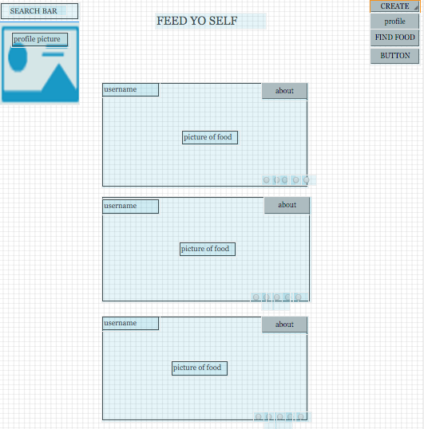
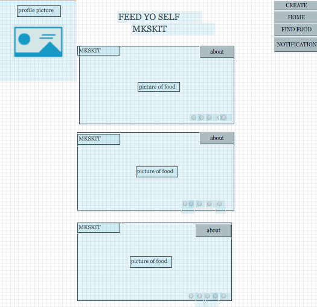
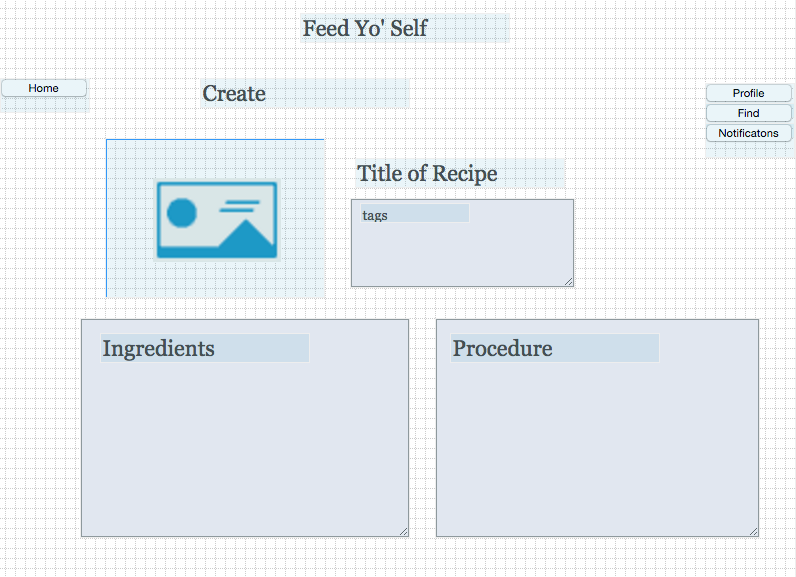

# comp20-s2016-team20

Project Title: "Feed Yo Self"

Problem Statement: Novice cookers need some assisting building blocks to learn
how to make meals and experiment with forming their own recipes that align with their dietary needs.

Our Solution: "Feed Yo Self" will inspire ideas for cooking through a feed of uploaded recipes and tips from users, and tags to identify characteristics of meals, such as specific ingredients or dietary preferences/restrictions.

Features to be Implemented:
  -Users will have logins and passwords for personal accounts, and profiles which contain all the recipes they have posted
  -Users can create recipes and post them with a picture and associative tags
  -Users can search for recipes based on their tags
  -Users can rate other recipes
  -A main feed will display all recipes in chronological order
  -User can save or like recipes
  -user can add the ingrediants of a specific recipe to their shopping cart for future grocery runs
  
  
  We will have filter specifications to reorder the user's main feed of recipes based on their preferences and dietary needs
  -a degree of difficulty filter(is the meal difficult to make)
  -a prep time filter (20, 30, 50min)
  -dietary filter (gluten free etc)
  

  OUT OF PICK 4:
  -Geolocation: Users can find stores near them to buy ingredients for recipes
  -Front-end framework (Bootstrap): For general layout of website
  -Push notifications: Users will receive notifications when their recipes are rated
  -Server-side data persistence: all recipes and tips uploaded will be stored in a database

Data to be Used and Collected: Users will upload recipes and tips which will be stored in a database

Algorithms/Special Techniques:
  -Search functions for recipe tags

Electronic Mockups:

####Home Page

####Profile Page

####Create Page

####Map Page

#Comments by Ming
* What external APIs and/or data sets will your team be using?
* 14 / 15
