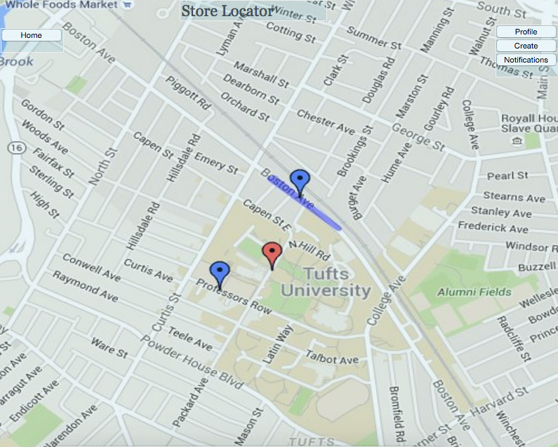

# comp20-s2016-team20

##Project Title: "Feed Yo Self"
Proposal (Draft 2)

##Problem Statement:
Novice cookers need some assisting building blocks to learn
how to make meals and experiment with forming their own recipes that align with their dietary needs.

##Our Solution:
"Feed Yo Self" will inspire ideas for cooking through a feed of uploaded recipes and tips from users, and tags to identify characteristics of meals, such as specific ingredients or dietary preferences/restrictions.

##Features to be Implemented:
  -Users will use Facebook to login to our website, in order to access their own personal profile page that displays all of the recipes they have posted

  -Users can create recipes and post them with a picture, a list of ingredients, instructions, prep/cooking time, and associative tags

  -Users can search for recipes based on tags using a search bar

  -A main feed will display all recipes in chronological order, with the most recent recipes at the top

  -User will be able to click on a map feature which finds and displays their location on a google map, and displays markers for all nearby grocery stores

##OUT OF PICK 4:
  -Geolocation: Users can find stores near them to buy ingredients for recipes

  -Front-end framework (Bootstrap): For general layout of recipes on website

  -Client-side data persistence: Local storage will keep track of when the user last visited their profile page and this date will be displayed near the Facebook login button

  -Server-side data persistence: All recipes and associated information uploaded will be stored in a database

##Data to be Used and Collected:
-Users will upload recipes which will be stored in a database

##Algorithms/Special Techniques:
  -Search functions for recipe tags

##External APIS We Will Use:
  -Google Maps Places for our map feature

  -Facebook Developers login feature

##Database We Will Use:
  -MongoDB

##Electronic Mockups:

####Home Page

####Profile Page

####Create Page

####Map Page

#Comments by Ming
* What external APIs and/or data sets will your team be using?
* 14 / 15
